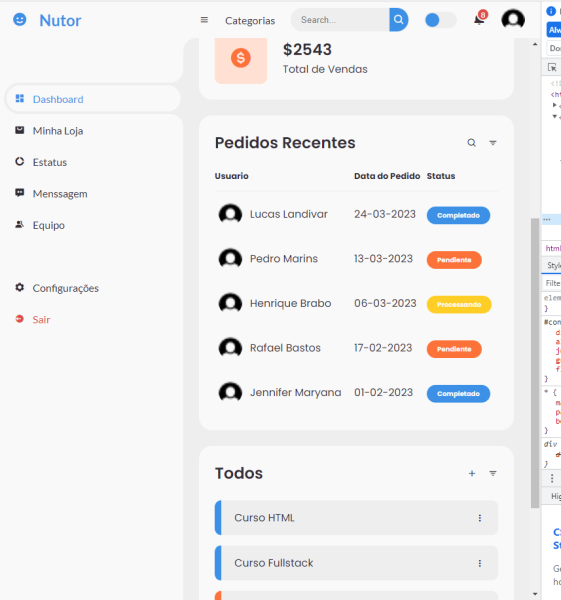

<h1>Dashboard</h1>

<h2>Description of the project</h2>

I have alredy make a dashboard projetct, but i only make it using HTML and CSS, this time i wanted to make a better dashboard using my knowledge in JavaScript.
 

<h2>What i learn</h2>

I learn how to do a responsive dashboard desing who also have the option to change the background color.

<h2>Tecnologies</h2>

HTML

CSS

JavaScript

<h2>Status</h2>

Finish.

<h2>Author</h2>

Lucas Landivar de Morais

